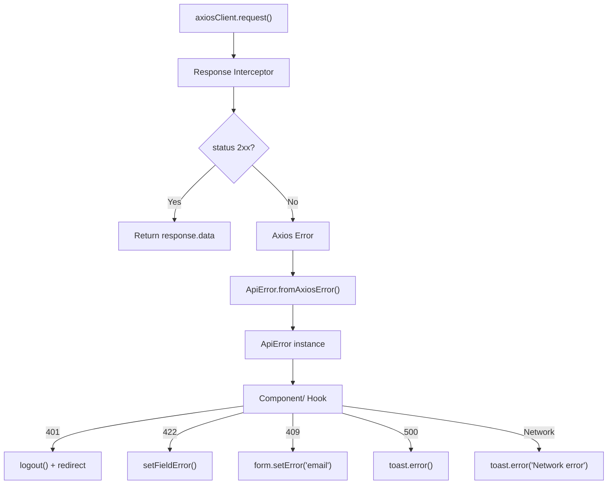

# API Integration

## Tổng quan

Tầng API được xây dựng trên **Axios** với 3 lớp:

1. **Axios Client** — instance dùng chung + interceptors
2. **ApiError** — structured error class
3. **Feature API functions** — mỗi feature có `api/` riêng

---

## Axios Client

### Vị trí

`src/lib/api-client.ts`

### Cấu hình

```typescript
export const axiosClient = axios.create({
  baseURL: config.apiBaseUrl,      // từ NEXT_PUBLIC_API_BASE_URL
  timeout: 10000,                   // 10 giây
  withCredentials: true,            // gửi cookie
  headers: {
    'Content-Type': 'application/json',
  },
})
```

### Request Interceptor

Tự động gắn CSRF token vào mỗi request:

```typescript
axiosClient.interceptors.request.use((config) => {
  const csrf = getCSRFToken()
  if (csrf) {
    config.headers['X-CSRF-TOKEN'] = csrf
  }
  return config
})
```

### Response Interceptor

Tự động parse lỗi:

```typescript
axiosClient.interceptors.response.use(
  (response) => response,
  (error) => Promise.reject(ApiError.fromAxiosError(error)),
)
```

---

## ApiError Class

### Vị trí

`src/lib/api-error.ts`

### Cấu trúc

```typescript
export class ApiError extends Error {
  constructor(
    public readonly status: number,      // HTTP status code
    public readonly code: string,         // Mã lỗi backend (VD: 'VALIDATION_ERROR')
    message: string,
    public readonly details?: Record<string, string[]>,  // Field errors
  )
}
```

### Helper methods

| Method | Ý nghĩa |
|---|---|
| `isUnauthorized` | `status === 401` |
| `isForbidden` | `status === 403` |
| `isNotFound` | `status === 404` |
| `isConflict` | `status === 409` |
| `isValidationError` | `status === 422` |
| `getFieldError(field)` | Lấy lỗi validation của field cụ thể |

### Factory

```typescript
static fromAxiosError(error: unknown): ApiError {
  if (axios.isAxiosError(error)) {
    const response = error.response?.data
    return new ApiError(
      error.response?.status ?? 0,
      response?.code ?? 'UNKNOWN',
      response?.message ?? error.message,
      response?.errors,
    )
  }
  if (error instanceof ApiError) return error
  return new ApiError(0, 'UNKNOWN', 'Network error')
}
```

### Cách dùng trong component

```typescript
try {
  const { data } = await loginApi(values)
  // Xử lý thành công
} catch (e) {
  if (e instanceof ApiError) {
    if (e.isValidationError) {
      form.setError('email', { message: e.getFieldError('email') })
    }
    if (e.isUnauthorized) {
      toast.error('Phiên đăng nhập hết hạn')
    }
  }
}
```

---

## Response Types

### Vị trí

`src/shared/types/response.ts`

### BaseResponse

```typescript
interface BaseResponse<T = unknown> {
  succeeded: boolean
  message: string | null
  code: string | null
  data: T | null
  errors: Record<string, string[]> | null
}
```

### PaginatedResponse

```typescript
interface PaginatedResponse<T = unknown> extends BaseResponse {
  pageNum: number
  pageSize: number
  total: number
  data: T[]
}
```

### BaseSearchRequest

```typescript
interface BaseSearchRequest {
  pageNum?: number
  pageSize?: number
  search?: string
  searchBy?: string
  sortBy?: string
  sortDirection?: 'asc' | 'desc'
  status?: string
}
```

---

## Feature API Functions

### Pattern

Mỗi feature có thư mục `api/` riêng:

```
features/auth/api/
├── login.api.ts       # POST /auth/login
└── register.api.ts    # POST /auth/register[space] ⚠️

features/landing/api/
└── contact.api.ts     # POST /user/contact
```

### Login API

```typescript
// features/auth/api/login.api.ts
export async function loginApi(data: LoginRequest): Promise<LoginResponse> {
  const response = await axiosClient.post<LoginResponse>(API_ENDPOINTS.LOGIN, data)
  return response.data
}
```

### Contact API

```typescript
// features/landing/api/contact.api.ts
export async function contactApi(data: ContactInput): Promise<BaseResponse<ContactOutput>> {
  const response = await axiosClient.post<BaseResponse<ContactOutput>>('/user/contact', data)
  return response.data
}
```

---

## Error Handling Flow



---

## Constants

### Vị trí

`src/lib/constants.ts`

```typescript
export const API_ENDPOINTS = {
  LOGIN: '/auth/login',
  REGISTER: '/auth/register',
} as const

export const HTTP_STATUS = {
  OK: 200,
  CREATED: 201,
  BAD_REQUEST: 400,
  UNAUTHORIZED: 401,
  FORBIDDEN: 403,
  NOT_FOUND: 404,
  CONFLICT: 409,
  VALIDATION_ERROR: 422,
  INTERNAL_ERROR: 500,
} as const
```

---

## Khi nào nên chỉnh sửa

- **Thêm API mới**: tạo file `*.api.ts` trong feature → export function → dùng trong hook
- **Sửa error handling**: sửa `ApiError` class
- **Sửa HTTP config**: sửa `api-client.ts`
- **Thêm endpoint constant**: thêm vào `lib/constants.ts`

## Điều không nên làm

- ❌ Không gọi `axiosClient` trực tiếp trong component
- ❌ Không catch error bằng `any` type
- ❌ Không duplicate endpoint string (dùng `API_ENDPOINTS`)
- ❌ Không để logic API trong component (dùng hooks)

## Anti-patterns hiện tại

1. **Chỉ có mutations, chưa có queries** — không cache dữ liệu
2. **Auth hooks dùng `alert()`** — thay vì throw ApiError để component xử lý
3. **Trailing space** trong endpoint register
4. **Mock data coupling** — chưa chuyển sang real API
