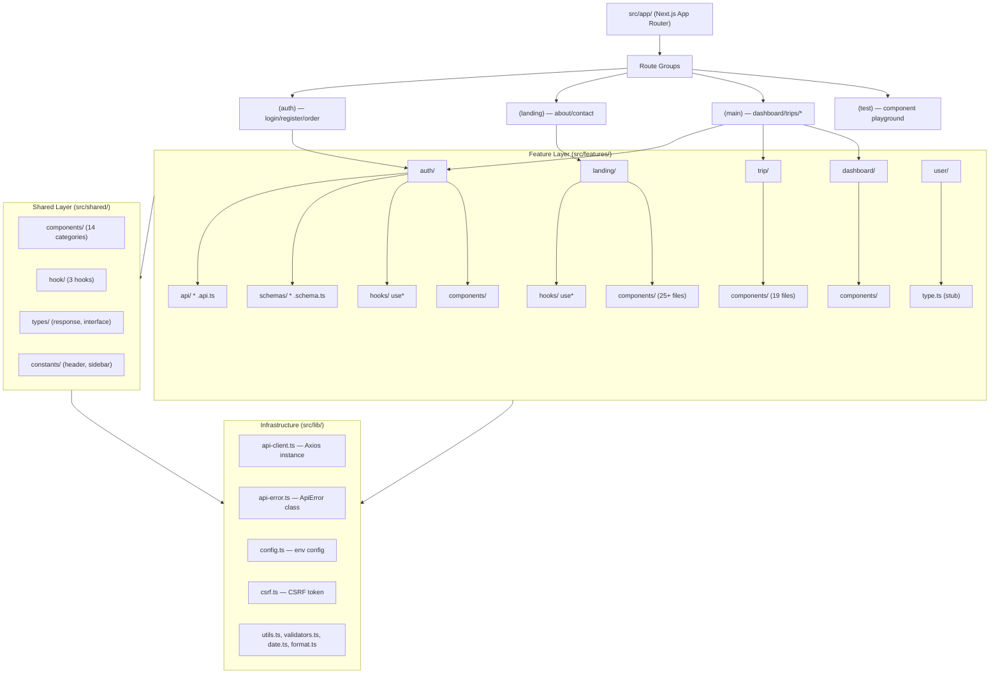
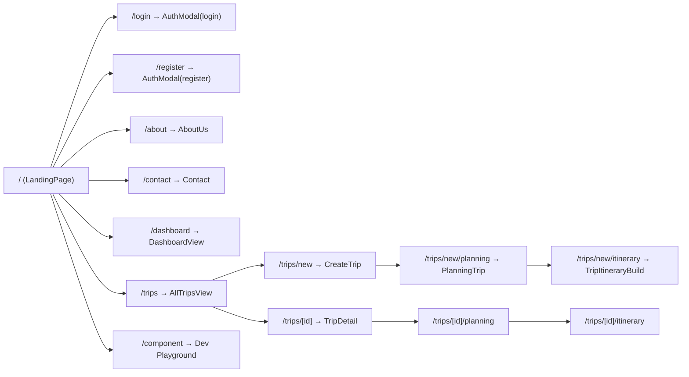

# Kiến trúc tổng thể

## Mô hình kiến trúc

**Feature-based Architecture + Layered Structure**:
- **Feature-based**: Business logic phân chia theo module (auth, trip, landing...)
- **Layered**: Phân tầng rõ ràng (App → Features → Shared → Lib)

## Sơ đồ kiến trúc



## Luồng phụ thuộc

```
app/ → features/ → shared/ → lib/
```

**Nguyên tắc**:
- `app/` chỉ import từ `features/` và `shared/`
- `features/` chỉ import từ `shared/` và `lib/` — không import feature khác
- `shared/` chỉ import từ `lib/` — không import từ `features/`
- `lib/` không import từ bất kỳ đâu trong project (chỉ thư viện ngoài)

## Server Components vs Client Components

| Type | Files | Lý do |
|---|---|---|
| Server Component | `layout.tsx` (root), `page.tsx` (root), `loading.tsx` | Không cần hooks, thuần render |
| Client Component | 16/17 pages + layout files | Cần `useRouter`, `useState`, context, effects |

### Hậu quả

Toàn bộ component tree render ở client. Cân nhắc chuyển một số pure presentational components sang Server Component để giảm bundle size và cải thiện SEO.

## Route Groups



## Provider chain

```tsx
// src/app/provider.tsx
<QueryProvider>
  <AuthProvider>
    <ThemeProvider>
      {children}
      <Toaster />
    </ThemeProvider>
  </AuthProvider>
</QueryProvider>
```

## Các rủi ro kiến trúc hiện tại

1. **Mock data coupling**: Dashboard và trips gắn chặt với mock data — khó chuyển sang real API
2. **God components**: `TripDetail.tsx` (4300 dòng) và `TripExpenseModal.tsx` (2480 dòng) vi phạm Single Responsibility
3. **Client-heavy**: 100% pages là Client Component — mất lợi thế SSR/RSC của Next.js
4. **Thiếu data fetching layer**: Chỉ có mutations, chưa có queries pattern
5. **Inconsistent patterns**: Auth dùng `alert()`, contact dùng `toast()` — thiếu standardization
