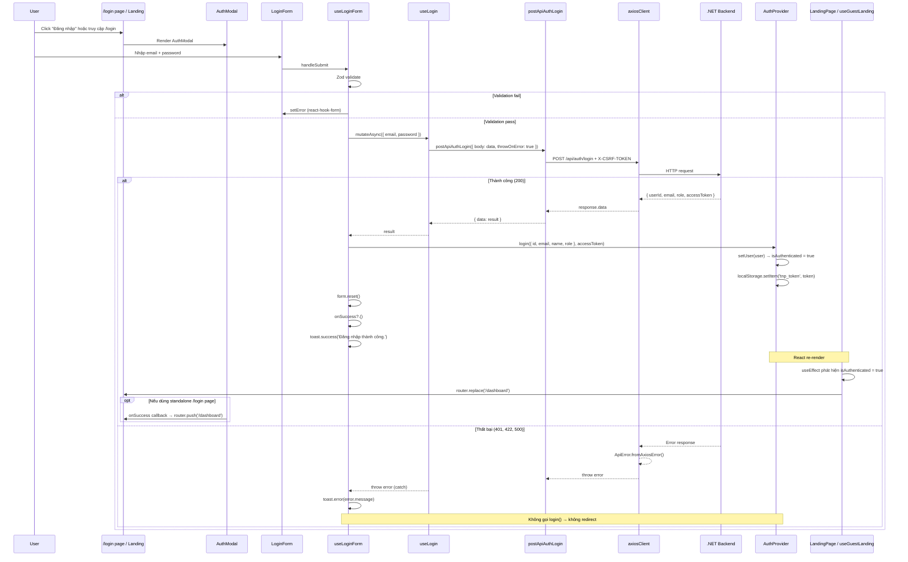

# Authentication Flow

## Tổng quan

Hệ thống auth gồm 3 phần:

1. **AuthProvider** — Context API cho auth state (`auth-provider.tsx`)
2. **Login / Register mutations** — TanStack Query (`useLogin`, `useRegister`)
3. **Redirect mechanism** — `useEffect` phản ứng khi `isAuthenticated` thay đổi

---

## AuthProvider

### Vị trí

`src/shared/components/providers/AuthProvider/auth-provider.tsx`

### Interface

```typescript
interface AuthState {
  user: User | null
  isAuthenticated: boolean
  isLoading: boolean
}

interface AuthContextType extends AuthState {
  login: (user: User, token: string) => void
  logout: () => void
  updateUser: (user: Partial<User>) => void
}
```

### User type

```typescript
interface User {
  id: string
  email: string
  name: string
  avatar?: string
  role?: string
}
```

### Provider chain

```
RootLayout → Providers → QueryProvider → AuthProvider → ThemeProvider → children
```

### Lifecycle

```
Mounted → useEffect → Kiểm tra localStorage('tnp_token')
  ├── Có token → setIsLoading(false) [TODO: validate + fetch user]
  └── Không token → setIsLoading(false)
```

### `login()` function

```typescript
const login = (newUser: User, token: string) => {
  localStorage.setItem('tnp_token', token)   // lưu JWT
  setUser(newUser)                            // set user state → isAuthenticated = true
  onLogin?.(newUser, token)                   // callback (không được dùng)
}
```

Sau khi `setUser(newUser)`:
- `isAuthenticated` chuyển từ `false` → `true`
- `useEffect` redirect ở component cha phát hiện thay đổi → `router.replace('/dashboard')`

---

## Login Flow (đã fix)

### Sequence Diagram



### Luồng chi tiết

```
Click "Đăng nhập"
  → goLogin() mở AuthModal
    → User nhập email/password, submit
      → useLoginForm.onSubmit()
        → mutation.mutateAsync(data)  // gọi API
          
          ├── Thành công:
          │   → AuthProvider.login(user, token)
          │     → localStorage.setItem('tnp_token', token)
          │     → setUser(newUser) → isAuthenticated = true
          │       → useEffect ở component cha
          │         → router.replace('/dashboard')
          │
          └── Thất bại (401):
              → catch(error)
                → toast.error(error.message)
                → KHÔNG gọi login()
                → KHÔNG redirect
                → Modal vẫn mở, user ở lại
```

### File tham chiếu

| Bước | File | Dòng |
|------|------|------|
| Click login → mở modal | `useLandingLayoutController.ts` | 89-92 |
| Form submit | `useLoginForm.ts` | 23-45 |
| Gọi API | `useLogin.ts` | 6-11 |
| Auth state | `auth-provider.tsx` | 63-67 |
| Redirect useEffect (landing page) | `useGuestLanding.ts` | 12-16 |
| Redirect useEffect (landing layout) | `useLandingLayoutController.ts` | 46-50 |
| LandingPage render null khi auth | `landing-page.tsx` | 17 |
| LandingLayout render null khi auth | `landing-layout.tsx` | 38 |

---

### Register Flow

Tương tự login, nhưng:
- Dùng `useRegister` mutation thay vì `useLogin`
- POST `/api/auth/register`
- Schema có thêm `username`, `confirmPassword`
- Sau register thành công → tự động gọi `login()` → redirect `/dashboard`

---

## Auth Modal Component

### Vị trí

`src/features/auth/components/AuthModal/AuthModal.tsx`

### Cấu trúc

```
AuthModal
├── Gradient header (Chào mừng bạn quay lại / Tạo tài khoản mới)
├── Tabs: Đăng nhập | Đăng ký
├── Tab content
│   ├── Đăng nhập → LoginForm(onSuccess)
│   └── Đăng ký → RegisterForm(onSuccess)
└── Dialog (shadcn/ui)
```

### Props

```typescript
interface AuthModalProps {
  isOpen: boolean
  onClose: () => void
  onSuccess: () => void      // Gọi sau khi login/register thành công (trước đây là dead code)
  activeTab: 'login' | 'register'
  onTabChange: (tab: 'login' | 'register') => void
}
```

### Cách dùng

```tsx
// Landing page (modal)
<AuthModal
  isOpen={isAuthModalOpen}
  onClose={() => setIsAuthModalOpen(false)}
  onSuccess={navigate.refresh}
  activeTab={authInitialTab}
  onTabChange={setAuthInitialTab}
/>

// Standalone /login page
<AuthModal
  isOpen={true}
  onClose={() => router.push('/')}
  onSuccess={() => router.push('/dashboard')}
  activeTab='login'
  onTabChange={() => {}}
/>
```

---

## LoginForm & useLoginForm

### Vị trí

- Component: `src/features/auth/components/login/login-form.tsx`
- Hook: `src/features/auth/hooks/login/useLoginForm.ts`

### Props

```typescript
interface LoginFormProps {
  onSuccess?: () => void    // Callback sau login thành công
}
```

### Flow xử lý submit

```typescript
const onSubmit = async (data: LoginFormData) => {
  try {
    const result = await mutation.mutateAsync(data)  // API call

    toast.success('Đăng nhập thành công.')

    login(                                            // AuthProvider.login()
      { id: result.userId!, email, name, role },
      result.accessToken,
    )

    form.reset()
    onSuccess?.()                                     // đóng modal / redirect
  } catch (error) {
    const message = error instanceof Error ? error.message : 'Đăng nhập thất bại!'
    toast.error(message)                              // chỉ toast, không login, không redirect
  }
}
```

---

## Redirect Mechanism

Có **2 cơ chế redirect** song song:

### 1. `useEffect` reactive (dùng cho Landing page)

**File**: `useGuestLanding.ts:12-16` và `useLandingLayoutController.ts:46-50`

```typescript
useEffect(() => {
  if (!isLoading && isAuthenticated) {
    router.replace('/dashboard')
  }
}, [isAuthenticated, isLoading, router])
```

Khi `AuthProvider.login()` gọi `setUser()` → React re-render → `isAuthenticated = true` → `useEffect` chạy → redirect.

### 2. `onSuccess` callback (dùng cho standalone /login, /register pages)

- `AuthModal.onSuccess` được truyền xuống `LoginForm`/`RegisterForm`
- Được gọi sau khi `login()` thành công trong `useLoginForm`/`useRegisterForm`
- Ví dụ: `onSuccess={() => router.push('/dashboard')}`

---

## Error Handling (đã fix)

### Vấn đề cũ (BUG)

Dùng `toast.promise()` từ sonner v2 → trả về `{ unwrap: fn }` (object), không phải Promise.

```typescript
// ❌ BUG: toast.promise trả về object, không phải Promise
const result = await (toast.promise(mutation.mutateAsync(data), {
  success: '...',
  error: (error) => error.message,
}) as unknown as Promise<LoginResponse>)

// result = { unwrap: fn }  (await non-Promise resolves ngay)
// result.userId = undefined
// login({ id: undefined!, ... }) vẫn chạy → user truthy → isAuthenticated = true → redirect
```

### Cách fix

```typescript
// ✅ try/catch — chỉ login khi API thành công
try {
  const result = await mutation.mutateAsync(data)
  toast.success('Đăng nhập thành công.')
  login(...)
  onSuccess?.()
} catch (error) {
  toast.error(error.message)   // không gọi login, không redirect
}
```

---

## CSRF Protection

### Cơ chế

```typescript
// src/lib/csrf.ts
export function getCSRFToken(): string | null {
  const value = `; ${document.cookie}`
  const parts = value.split(`; CSRF-TOKEN=`)
  if (parts.length === 2) {
    return parts.pop()?.split(';')[0] || null
  }
  return null
}
```

### Axios interceptor (`src/shared/api/index.ts`)

```typescript
client.instance.interceptors.request.use((config) => {
  const csrf = getCSRFToken()
  if (csrf) {
    config.headers['X-CSRF-TOKEN'] = csrf
  }
  return config
})

client.instance.interceptors.response.use(
  (response) => response,
  (error) => Promise.reject(ApiError.fromAxiosError(error)),
)
```

---

## Route Protection

### Cơ chế hiện tại

1. **Landing page** (`landing-page.tsx:17` và `landing-layout.tsx:38`):
   ```typescript
   if (isAuthenticated) return null
   ```
   Không render nội dung landing nếu đã đăng nhập. Kết hợp với `useEffect` redirect.

2. **Protected routes** `(main)/`:
   - `MainLayout` không kiểm tra auth
   - Chưa có middleware guard
   - User chưa login vẫn có thể truy cập `/dashboard`, `/trips` bằng URL trực tiếp

### TODO

- [ ] Thêm Next.js middleware cho route protection
- [ ] Validate token khi page refresh
- [ ] Fetch user info khi có token
- [ ] Add `not-found.tsx`
