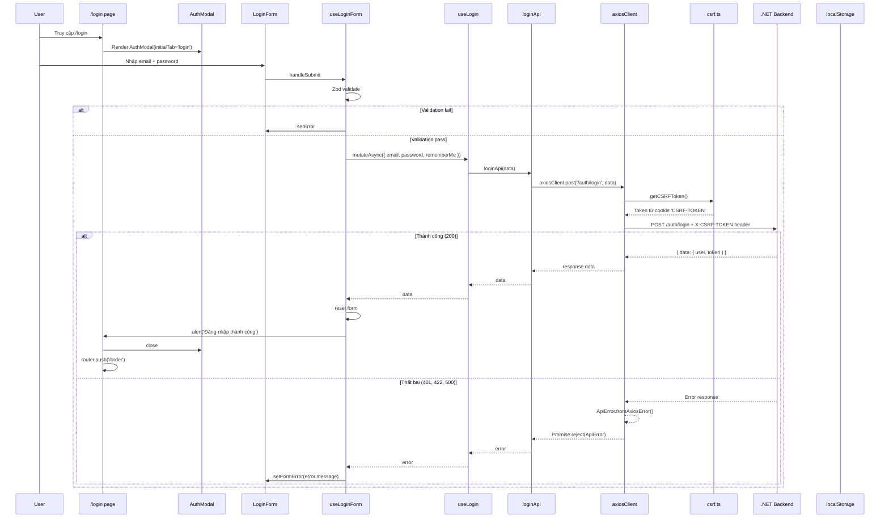

# Authentication Flow

## Tổng quan

Hệ thống auth gồm 3 phần:

1. **AuthProvider** — Context API cho auth state
2. **Login / Register mutations** — TanStack Query
3. **CSRF Protection** — Axios interceptor

---

## AuthProvider

### Vị trí

`src/shared/components/providers/AuthProvider/auth-provider.tsx`

### Interface

```typescript
interface AuthState {
  user: User | null
  isAuthenticated: boolean
  isLoading: boolean
}

interface AuthContextType extends AuthState {
  login: (user: User, token: string) => void
  logout: () => void
  updateUser: (user: Partial<User>) => void
}
```

### User type

```typescript
interface User {
  id: string
  email: string
  name: string
  avatar?: string
  role?: string
}
```

### Provider chain

```
QueryProvider → AuthProvider → ThemeProvider
```

### Lifecycle

```
Mounted → useEffect → Kiểm tra localStorage('auth_token')
  ├── Có token → setIsLoading(false) [TODO: validate + fetch user]
  └── Không token → setIsLoading(false)
```

---

## Login Flow



### Register Flow

Tương tự login, nhưng:
- POST `/auth/register` (⚠️ có trailing space trong code)
- Schema có thêm `fullName`, `confirmPassword`
- `register-form.tsx` import nhầm `useLoginForm`

---

## CSRF Protection

### Cơ chế

```typescript
// src/lib/csrf.ts
export function getCSRFToken(): string | null {
  const value = `; ${document.cookie}`
  const parts = value.split(`; CSRF-TOKEN=`)
  if (parts.length === 2) {
    return parts.pop()?.split(';')[0] || null
  }
  return null
}
```

### Axios interceptor

```typescript
// src/lib/api-client.ts
axiosClient.interceptors.request.use((config) => {
  const csrf = getCSRFToken()
  if (csrf) {
    config.headers['X-CSRF-TOKEN'] = csrf
  }
  return config
})
```

---

## Auth Modal Component

### Vị trí

`src/features/auth/components/AuthModal/AuthModal.tsx`

### Cấu trúc

```
AuthModal
├── Gradient header
├── Tabs: Đăng nhập | Đăng ký
├── Tab content
│   ├── Đăng nhập → LoginForm
│   └── Đăng ký → RegisterForm
└── Footer
```

### Props

```typescript
interface AuthModalProps {
  isOpen: boolean
  onClose: () => void
  onSuccess: () => void
  initialTab?: 'login' | 'register'
}
```

---

## Profile Modal

### Vị trí

`src/features/auth/components/ProfileModal/ProfileModal.tsx`

### Tabs

| Tab | Nội dung |
|---|---|
| Personal | Avatar upload, fullName, email, phone, date of birth |
| Security | Password change, 2FA toggle |
| Finance | Payment methods, banking info |
| Notifications | Notification preferences |
| Settings | Language, theme, region |

Dùng `framer-motion` cho tab transitions.

---

## Route Protection

### Cơ chế hiện tại

1. **Landing page** (`guest-landing.tsx`): `useGuestLanding()` hook kiểm tra `isAuthenticated`
   - Nếu đã login → redirect `/dashboard`
   - Nếu chưa → render landing content

2. **Protected routes**: Trong `(main)` route group — có sidebar, header, profile modal
   - Chưa có middleware guard

### TODO

- [ ] Thêm Next.js middleware cho route protection
- [ ] Validate token khi page refresh
- [ ] Fetch user info khi có token
- [ ] Add `not-found.tsx`

---

## Anti-patterns

### 1. Dùng `alert()` thay vì toast

```typescript
// ❌ Hiện tại
onSuccess: () => alert('Đăng nhập thành công')
onError: (e) => alert(e.message)

// ✅ Nên dùng
onSuccess: () => toast.success('Đăng nhập thành công')
onError: (e) => toast.error(e.message)
```

### 2. Import nhầm hook

```typescript
// ❌ register-form.tsx import sai
import { useLoginForm } from '../../hooks/login/useLoginForm'

// ✅ Phải import
import { useRegister } from '../../hooks/register/useRegister'
```

### 3. Trailing space trong endpoint

```typescript
// ❌ Sai
const url = '/auth/register '

// ✅ Đúng
const url = '/auth/register'
```
