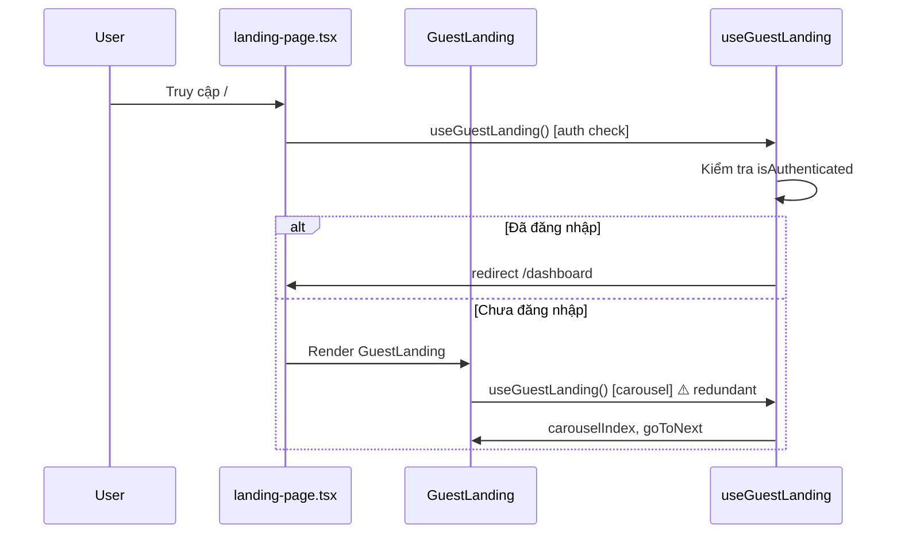
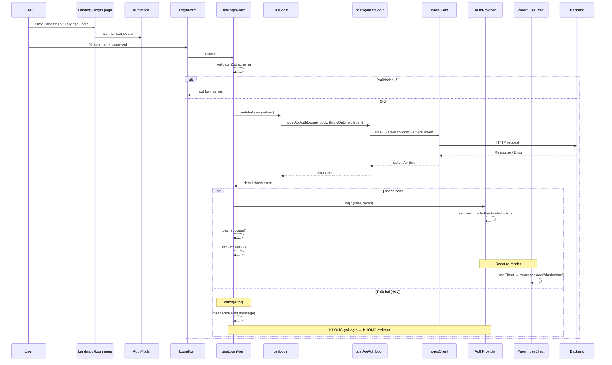
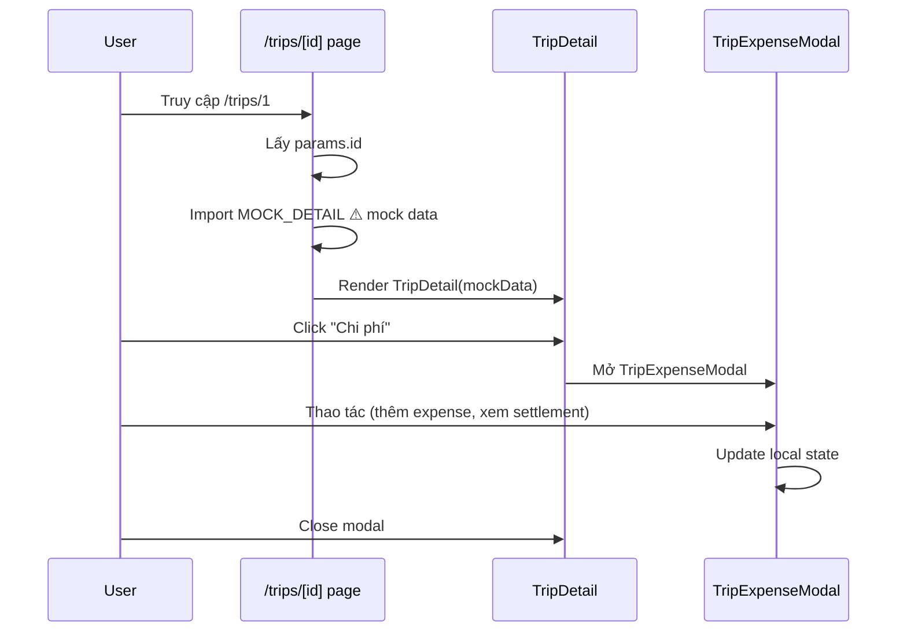
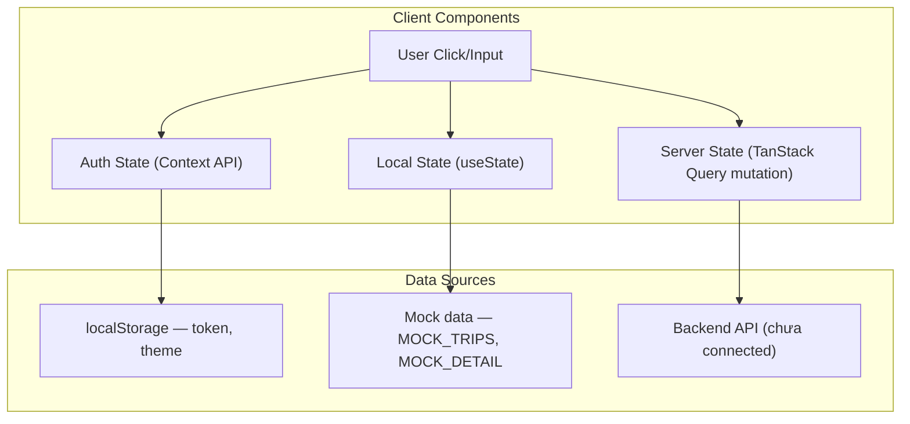
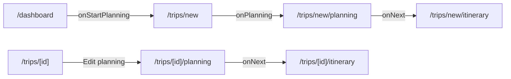

# Data Flow

## Tổng quan luồng dữ liệu

Ứng dụng sử dụng **Client-Side Rendering (CSR)** với Next.js App Router.
Tất cả page đều là Client Component, data flow tuân theo pattern:

```
User Action → Page (Client) → Feature Component → Hook (useMutation) 
  → API Function → Axios Client → Backend → Response → UI Update
```

## Rendering Strategy

| Loại | Files | Chi tiết |
|---|---|---|
| Server Component | 3 files | `layout.tsx` (root), `page.tsx` (root), `loading.tsx` |
| Client Component | ~16 files | Tất cả page + layout còn lại |
| SSR | Không dùng | — |
| ISR | Không dùng | — |
| SSG | Mặc định | Next.js App Router mặc định static |

### Hậu quả của việc dùng 100% Client Components

- **Không tối ưu SEO**: Search engine không thấy nội dung thật
- **Bundle size lớn**: Toàn bộ component tree gửi xuống client
- **FCP/LCP chậm hơn**: So với Server Components
- **Không tận dụng RSC**: Next.js 16 mạnh về RSC nhưng chưa dùng

---

## UI Flow (Landing Page)



## UI Flow (Login)



## UI Flow (Trip Detail)



## State Flow



## Navigation Flow (Wizard)



Navigation dùng `useRouter().push()` — không dùng Next.js `<Link>` component.

## Khi nào dùng Client Component vs Server Component

### Nên dùng Client Component khi
- Cần hooks (`useState`, `useEffect`, `useRouter`)
- Cần event handlers (`onClick`, `onSubmit`)
- Cần browser APIs (`localStorage`, `document`)
- Cần context (`useAuth`, `useTheme`)

### Nên dùng Server Component khi
- Chỉ render JSX thuần (không hooks, không events)
- Cần SEO
- Không cần interactivity
- Fetch data từ API (RSC)

### Khuyến nghị
- Chuyển `AllTripsView`, `TripCard`, `WelcomeHero` sang Server Component
- Giữ `TripDetail`, `AuthModal`, `Forms` là Client Component
