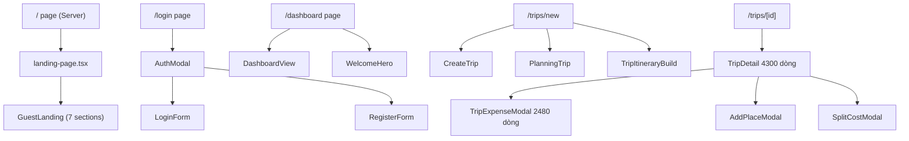

# Feature Map

## Tổng quan

5 features, tổng cộng ~65 files.

```
features/
├── auth/       (14 files)  — Authentication & profile
├── dashboard/  (5 files)   — Dashboard tổng quan
├── landing/    (25+ files) — Marketing pages
├── trip/       (19 files)  — Trip CRUD & expense
└── user/       (2 files)   — User entity (stub)
```

---

## `auth` — Authentication (14 files)

### Mục đích
Xử lý đăng nhập, đăng ký, profile modal.

### Cấu trúc

```
auth/
├── type.ts
├── api/
│   ├── login.api.ts      # POST /auth/login
│   └── register.api.ts   # POST /auth/register[space] ⚠️ có trailing space
├── schemas/
│   ├── login.schema.ts   # Zod: email, password(min 6), rememberMe
│   └── register.schema.ts# Zod: fullName, email, password, confirmPassword
├── hooks/
│   ├── login/
│   │   ├── useLogin.ts       # useMutation → postApiAuthLogin
│   │   └── useLoginForm.ts   # react-hook-form + Zod + try/catch + AuthProvider.login()
│   └── register/
│       └── useRegister.ts    # useMutation → registerApi
└── components/
    ├── login/
    │   └── login-form.tsx    # Form đăng nhập + Google OAuth button
    ├── register/
    │   └── register-form.tsx # ⚠️ import nhầm useLoginForm
    ├── AuthModal/
    │   ├── AuthModal.tsx     # Dialog tabs (Đăng nhập/Đăng ký)
    │   └── index.ts
    └── ProfileModal/
        ├── ProfileModal.tsx  # 5 tabs modal + framer-motion
        └── index.ts
```

### Ví dụ — `schemas/login.schema.ts`

```typescript
export const loginSchema = z.object({
  email: z.string().email('Email không hợp lệ'),
  password: z.string().min(6, 'Mật khẩu tối thiểu 6 ký tự'),
  rememberMe: z.boolean().optional(),
})
```

### Vấn đề hiện tại
1. `register.api.ts` endpoint có trailing space: `'/auth/register '`
2. `register-form.tsx` còn code cũ comment (block comment phần old UI)

---

## `dashboard` — Dashboard (5 files)

### Mục đích
Trang tổng quan sau đăng nhập.

### Cấu trúc

```
dashboard/
└── components/
    ├── index.ts
    ├── DashboardView/
    │   ├── DashboardView.tsx  # Trip list + summary stats + CTAs
    │   └── index.ts
    └── WelcomeHero/
        ├── WelcomeHero.tsx    # "Chào bạn, Tuan!" greeting
        └── index.ts
```

### Đặc điểm
- **100% presentational** — không hooks, không API
- Props-driven: nhận `trip: Trip[]`, `stats: SummaryStat[]`, callbacks
- Barrel export qua `components/index.ts`

---

## `landing` — Landing Pages (25+ files)

### Mục đích
Marketing pages cho guest users.

### Cấu trúc

```
landing/
├── constants/
│   └── guest.constant.ts     # 5 features, 4 steps, 8 FAQs, 8 testimonials, 6 places, 3 trips, 3 values
├── types/
│   ├── contact.type.ts       # ContactInput, ContactOutput
│   └── landing.type.ts       # TestimonialItem
├── schema/
│   └── contact.schema.ts     # Zod: name, email, description (10-500 chars)
├── api/
│   └── contact.api.ts        # POST /user/contact
├── hooks/
│   ├── useGuestLanding.ts    # Auth check + carousel auto-rotate
│   └── contact/
│       ├── useContact.ts     # useMutation → contactApi
│       └── useContactForm.ts # react-hook-form + Zod + toast
└── components/
    ├── landing-page.tsx      # Entry point → calls useGuestLanding() 2 lần ⚠️
    ├── GuestLanding/         # 7 sections
    │   ├── guest-landing.tsx
    │   └── layout/
    │       ├── hero-section.tsx
    │       ├── popular-section.tsx
    │       ├── timeline-section.tsx
    │       ├── testimonials-section.tsx
    │       ├── faq-section.tsx
    │       ├── cta-section.tsx
    │       └── footer-section.tsx
    ├── AboutUs/              # 4 sections
    │   ├── about-us.tsx
    │   └── layout/
    │       ├── hero-section.tsx
    │       ├── founder-section.tsx
    │       ├── mission-section.tsx
    │       └── contact-section.tsx
    └── Contact/              # 2 sections
        ├── Contact.tsx
        └── layout/
            ├── contact-form.tsx
            └── contact-info.tsx
```

### Vấn đề hiện tại
1. `landing-page.tsx` gọi `useGuestLanding()` 2 lần (redundant)
2. Toàn bộ content static trong `guest.constant.ts` — chưa có API integration

---

## `trip` — Trip Management (19 files)

### Mục đích
Quản lý chuyến đi: tạo, lên kế hoạch, chi phí.

### Cấu trúc

```
trip/
└── components/
    ├── index.ts              # Barrel export (9 components)
    ├── AllTripsView/         # Grid TripCard + back nav
    ├── TripCard/             # Card: image, status, title, dates, participants
    ├── CreateTrip/           # "Explore" page with static places
    ├── PlanningTrip/         # Form: title, dates, budget, location, companions, cover
    ├── TripDetail.tsx        # ⚠️ 4300 dòng — overview + participants + activities + expenses + invite + settings
    ├── TripItineraryBuild/   # Day-by-day itinerary builder
    ├── AddPlaceModal/        # ⚠️ typo: "AdddPlaceModal"
    ├── TripExpenseModal.tsx  # ⚠️ 2480 dòng — Individual/Group tabs + summary + settlements + complaints + QR
    └── SplitCostModal/       # Per-participant cost split
```

### Đặc điểm
- **Không có `types/`, `api/`, `hooks/`** — khác với auth và landing
- **Toàn bộ mock data** — không real API call
- **God components**: `TripDetail.tsx` (4300 dòng), `TripExpenseModal.tsx` (2480 dòng)
- Dùng `framer-motion` cho modal transitions
- UI hoàn toàn bằng tiếng Việt

---

## `user` — User (2 files)

### Mục đích
User entity + hooks (chưa hoàn thiện).

### Cấu trúc

```
user/
├── type.ts          # User interface: fullName, age, createdAt, userName
└── hooks/
    └── useUser.ts   # File rỗng (0 dòng)
```

### Hiện trạng
- **Stub** — chưa implement
- User type trong `type.ts` khác với `User` interface trong `AuthProvider`

---

## Component tree diagram


