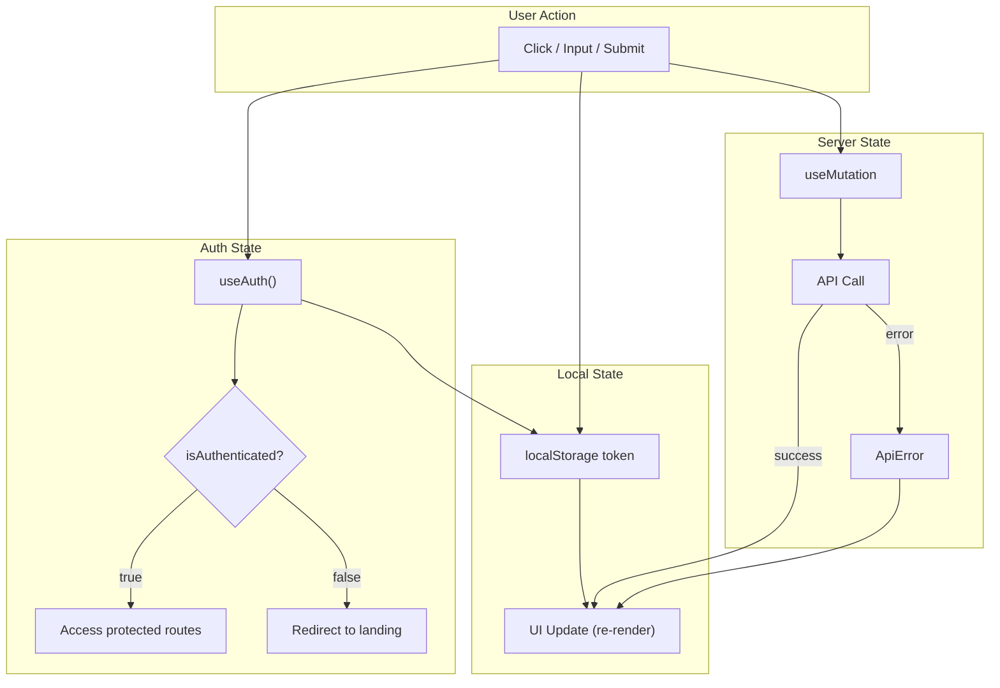

# State Management

## Tổng quan

Ứng dụng quản lý state ở 3 tầng:

| Tầng | Công nghệ | Phạm vi |
|---|---|---|
| Server State | TanStack Query v5 | API data fetching & mutations |
| Auth State | React Context (AuthProvider) | Authentication |
| Local State | `useState` / `useReducer` | UI state (modal, form, tabs) |

---

## 1. Server State — TanStack Query v5

### Cấu hình (`QueryProvider`)

```typescript
// src/shared/components/providers/QueryProvider/query-provider.tsx
const queryClient = new QueryClient({
  defaultOptions: {
    queries: {
      staleTime: 60 * 1000,    // 1 phút
      gcTime: 5 * 60 * 1000,   // 5 phút
      retry: 1,
      refetchOnWindowFocus: false,
      refetchOnMount: true,
    },
    mutations: {
      retry: 1,
    },
  },
})
```

### Mutations (hiện tại)

Chỉ dùng `useMutation`, chưa có `useQuery`:

| Mutation | File | Trigger |
|---|---|---|
| `useLogin` | `features/auth/hooks/login/useLogin.ts` | Login form submit |
| `useRegister` | `features/auth/hooks/register/useRegister.ts` | Register form submit |
| `useContact` | `features/landing/hooks/contact/useContact.ts` | Contact form submit |

### Pattern hiện tại

```typescript
// features/auth/hooks/login/useLogin.ts
export function useLogin() {
  return useMutation({
    mutationFn: loginApi,
    onSuccess: (data) => {
      alert('Đăng nhập thành công')  // ⚠️ nên dùng toast
    },
    onError: (error) => {
      alert('Đăng nhập thất bại')    // ⚠️ nên dùng toast
    },
  })
}
```

### Vấn đề
1. Dùng `alert()` thay vì toast system
2. Chưa có `useQuery` pattern — không cache dữ liệu
3. Chưa dùng `@lukemorales/query-key-factory` mặc dù đã cài

---

## 2. Auth State — Context API

### Cấu trúc

```typescript
// AuthProvider (Context API)
interface AuthState {
  user: User | null
  isAuthenticated: boolean
  isLoading: boolean
}

interface AuthContextType extends AuthState {
  login: (user: User, token: string) => void
  logout: () => void
  updateUser: (user: Partial<User>) => void
}
```

### Flow

```
AuthProvider (app/provider.tsx)
  → useAuth() hook (shared/contexts/AuthContext)
    → LoginForm gọi login()
      → localStorage.setItem('auth_token', token)
      → setUser(user)
```

### Token management
- Lưu: `localStorage.setItem('auth_token', token)`
- Xóa: `localStorage.removeItem('auth_token')`
- Check khi mount: `useEffect` kiểm tra `localStorage.getItem(tokenKey)`
- **TODO**: Validate token + fetch user info khi refresh page

### Vấn đề
- Chưa validate token khi page refresh
- Chưa fetch user info sau khi có token
- `User` interface trong AuthProvider khác với `User` trong `entities/user.ts`

---

## 3. Local State — useState

### Các trường hợp dùng

| Component | State | Mục đích |
|---|---|---|
| `AuthModal` | `activeTab` | Chuyển tab Login/Register |
| `ProfileModal` | `activeTab` | Chuyển tab Personal/Security/... |
| `landing-page` | `carouselIndex` | Testimonial carousel |
| `TripDetail` | `activeTab`, `showModal` | Tab navigation + modal toggle |
| `TripExpenseModal` | `expenseTab`, `members`, `settlements` | Expense management |
| `GuestLanding` | `carouselIndex` | Auto-rotate carousel |

### Pattern

```typescript
const [isOpen, setIsOpen] = useState(false)
const [activeTab, setActiveTab] = useState<'login' | 'register'>('login')
```

---

## State Flow Diagram



## Khuyến nghị

1. **Dùng `@lukemorales/query-key-factory`** cho query keys chuẩn hóa
2. **Thêm `useQuery`** cho data fetching (trip list, detail, user info)
3. **Chuẩn hóa error/success feedback** — dùng toast thay cho alert
4. **Implement token validation** — fetch user info khi có token
5. **Thống nhất User type** — giữa AuthProvider và entities/user.ts
