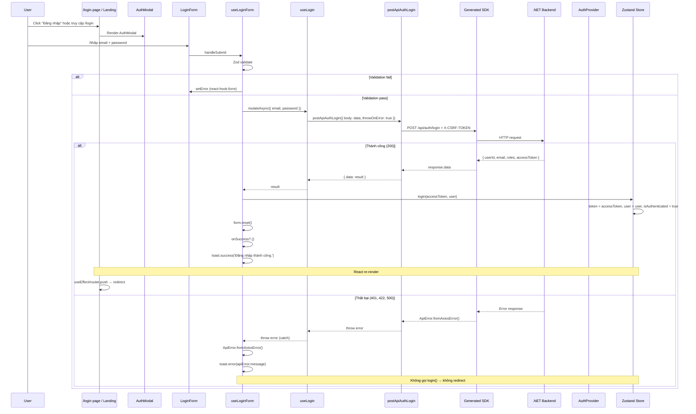
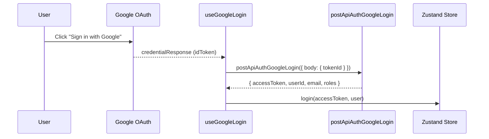

# Authentication Flow

## Tổng quan

Hệ thống auth gồm 3 phần:

1. **Zustand store** — Auth state management (`auth-store.ts`)
2. **AuthProvider** — Context API wrapper cho React components (`auth-provider.tsx`)
3. **Silent refresh** — Auto refresh token khi page refresh (`useAuth.ts`)

---

## Provider chain

```
RootLayout → Providers → QueryProvider → GoogleOAuthProvider → AuthProvider → ThemeProvider → children
```

## Auth State Architecture

### Zustand Store (RAM)

```typescript
// src/shared/stores/auth-store.ts
interface AuthState {
  token: string | null        // JWT access token (in-memory only)
  user: User | null
  isAuthenticated: boolean
  isLoading: boolean
  isRefreshing: boolean
}
```

### Token Management

- **Access token**: Lưu trong Zustand store (RAM, không persist)
- **Refresh token**: HttpOnly cookie (browser tự gửi, không access được từ JS)
- **Silent refresh**: Khi F5/page refresh → `useSilentRefresh()` gọi `performRefresh()` → POST `/auth/refresh-token` → lấy access token mới
- **Auto refresh**: Response interceptor detect 401 → `performRefresh()` → retry request

### Lifecycle

```
Mounted → useSilentRefresh()
  ├── Đã có token (SPA navigate) → setLoading(false) → render ngay
  └── Chưa có token (F5 / tab mới)
      → performRefresh() (POST /auth/refresh-token)
        ├── Refresh OK → GET /auth/me → setUser() → setLoading(false)
        └── Refresh fail → logout() → setLoading(false) → render login
```

---

## Login Flow

### Sequence Diagram



---

## Register Flow

Tương tự login, nhưng:
- Dùng `useRegister` mutation (generated SDK `postApiAuthRegister`)
- Schema có thêm `username`, `confirmPassword`
- Password validation dùng shared `passwordField()` schema
- Sau register thành công → toast success → redirect về login page

---

## Google OAuth Flow



---

## Error Handling

```typescript
// Trong form hooks — dùng ApiError class
try {
  const result = await mutation.mutateAsync(data)
  // success handling
} catch (error) {
  const apiError = ApiError.fromAxiosError(error)
  toast.error(apiError.message)
  // apiError.status — HTTP status code
  // apiError.getFieldError('email') — validation field error
}
```

---

## CSRF Protection

```typescript
// Request interceptor — tự động gắn CSRF token
client.instance.interceptors.request.use((reqConfig) => {
  const csrf = getCSRFToken()
  if (csrf) {
    reqConfig.headers['X-CSRF-TOKEN'] = csrf
  }
  return reqConfig
})
```

---

## Route Protection

### Hiện tại

1. **Landing page** (`landing-page.tsx` và `landing-layout.tsx`):
   ```typescript
   if (isAuthenticated) return null
   ```
   Không render nội dung landing nếu đã đăng nhập.

2. **Main layout** (`useMainLayoutController.ts`):
   ```typescript
   useEffect(() => {
     if (!isLoading && !isAuthenticated) {
       router.replace('/')
     }
   }, [isAuthenticated, isLoading, router])
   ```
   Redirect về landing nếu chưa đăng nhập.

### TODO

- [ ] Thêm Next.js middleware cho route protection
- [ ] Add `not-found.tsx`
