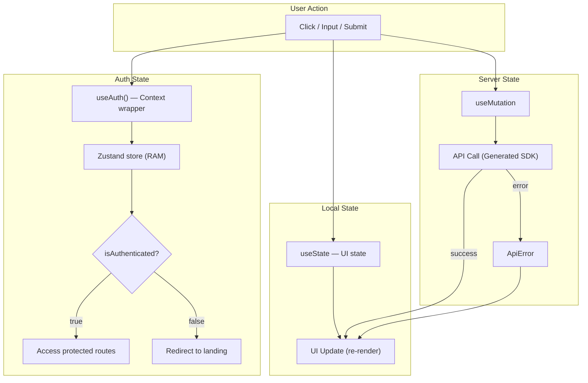

# State Management

## Tổng quan

Ứng dụng quản lý state ở 3 tầng:

| Tầng | Công nghệ | Phạm vi |
|---|---|---|
| Server State | TanStack Query v5 | API data fetching & mutations |
| Auth State | Zustand + Context API wrapper | Authentication |
| Local State | `useState` / `useReducer` | UI state (modal, form, tabs) |

---

## 1. Server State — TanStack Query v5

### Cấu hình (`QueryProvider`)

```typescript
// src/shared/components/providers/QueryProvider/query-provider.tsx
const queryClient = new QueryClient({
  defaultOptions: {
    queries: {
      staleTime: 60 * 1000,    // 1 phút
      gcTime: 5 * 60 * 1000,   // 5 phút
      retry: 1,
      refetchOnWindowFocus: false,
      refetchOnMount: true,
    },
    mutations: {
      retry: 1,
    },
  },
})
```

### Mutations (hiện tại)

| Mutation | File | Trigger |
|---|---|---|
| `useLogin` | `features/auth/hooks/login/useLogin.ts` | Login form submit |
| `useRegister` | `features/auth/hooks/register/useRegister.ts` | Register form submit |
| `useGoogleLogin` | `features/auth/hooks/login/useGoogleLogin.ts` | Google OAuth |
| `useContact` | `features/landing/hooks/contact/useContact.ts` | Contact form submit |

### Pattern hiện tại

```typescript
// features/auth/hooks/login/useLogin.ts
export const useLogin = () => {
  return useMutation<LoginResponse, Error, LoginCommand>({
    mutationFn: async (data) => {
      const { data: result } = await postApiAuthLogin({ body: data, throwOnError: true })
      return result
    },
  })
}
```

### Vấn đề
1. Chưa có `useQuery` pattern — không cache dữ liệu
2. Chưa dùng `@lukemorales/query-key-factory` mặc dù đã cài

---

## 2. Auth State — Zustand + Context API wrapper

### Cấu trúc

```typescript
// Zustand store (src/shared/stores/auth-store.ts)
interface AuthState {
  token: string | null
  user: User | null
  isAuthenticated: boolean
  isLoading: boolean
  isRefreshing: boolean
  
  setToken: (token: string | null) => void
  setUser: (user: User | null) => void
  login: (token: string, user: User) => void
  logout: () => void
  setLoading: (isLoading: boolean) => void
  setRefreshing: (isRefreshing: boolean) => void
}
```

### Flow

```
AuthProvider (app/provider.tsx)
  → useSilentRefresh() hook (shared/hooks/useAuth.ts)
    → performRefresh() — lấy token từ HttpOnly cookie
      → GET /auth/me — lấy user profile
        → setUser(user) → Zustand store
```

### Token management
- **Access token**: Lưu trong Zustand store (RAM, không persist)
- **Refresh token**: HttpOnly cookie (browser tự gửi)
- **Silent refresh**: Khi page refresh, `useSilentRefresh()` gọi `performRefresh()` để lấy access token mới
- **Auto refresh**: Response interceptor detect 401 → `performRefresh()` → retry request

### Provider chain

```tsx
// src/app/provider.tsx
<QueryProvider>
  <GoogleOAuthProvider>
    <AuthProvider>
      <ThemeProvider>
        {children}
        <Toaster />
      </ThemeProvider>
    </AuthProvider>
  </GoogleOAuthProvider>
</QueryProvider>
```

### Vấn đề
- Chưa có middleware guard cho protected routes
- `useSilentRefresh()` chạy 1 lần khi mount — OK nhưng cần handle edge cases

---

## 3. Local State — useState

### Các trường hợp dùng

| Component | State | Mục đích |
|---|---|---|
| `AuthModal` | `activeTab` | Chuyển tab Login/Register |
| `ProfileModal` | `activeTab` | Chuyển tab Personal/Security/... |
| `landing-page` | `carouselIndex` | Testimonial carousel |
| `TripDetail` | `activeTab`, `showModal` | Tab navigation + modal toggle |
| `TripExpenseModal` | `expenseTab`, `members`, `settlements` | Expense management |
| `GuestLanding` | `carouselIndex` | Auto-rotate carousel |

### Pattern

```typescript
const [isOpen, setIsOpen] = useState(false)
const [activeTab, setActiveTab] = useState<'login' | 'register'>('login')
```

---

## State Flow Diagram



## Khuyến nghị

1. **Dùng `@lukemorales/query-key-factory`** cho query keys chuẩn hóa
2. **Thêm `useQuery`** cho data fetching (trip list, detail, user info)
3. **Thêm Next.js middleware** cho route protection
